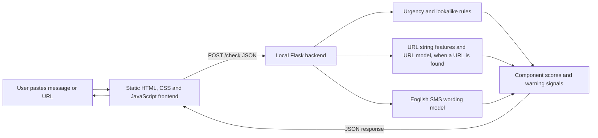

# Aegis


> **Aegis is an experimental scam-warning demo, not a security guarantee.** It highlights selected patterns in pasted text and URL strings so people can pause and verify through trusted channels.

## Project overview

Aegis is a student-built cybersecurity project for checking suspicious messages and links, developed for ASYNC'26 Track 3: Cybersecurity & Defense. A user pastes text into a browser page; a local Flask service returns warning signals, separate component scores, and a plain-English explanation.

The V2 demo targets three limited signals:

- **URL phishing patterns:** a Random Forest analyzes features of the URL string. It does not visit the website.
- **English SMS spam-like wording:** a TF-IDF Logistic Regression estimates whether wording resembles spam or ham in an older SMS dataset.
- **Selected rule warnings:** simple rules flag a few urgency phrases and hard-coded lookalike strings.

The combined `risk_score` is the largest component score. It is a heuristic/model score, **not a calibrated probability** that a message is fraudulent or safe. A low score does not establish legitimacy.

## Current status

| Area | Status |
| --- | --- |
| V2 package | Experimental demo in `v2-test-model/`; the V2 integration update is PR #6 from `person-c-frontend` to `main`. Until merged, fetch the PR branch as shown below. |
| Local demo | Verified on Python 3.12: both artifacts load, `/health` succeeds, `/check` returns results, and the bundled frontend serves. |
| Automated CI, test coverage, lint, static analysis | Not configured in this snapshot. Manual smoke-check commands are below. |
| Benchmarks | No independently measured latency or throughput figures are available. |
| Screenshots/video | No demo media is committed yet. Add an approved screenshot or demo-video link after final browser review. |
| Model artifact terms | Model weights are included so the demo can run; this repository does not specify a separate model-weight license. Confirm their redistribution terms with the team. |

## Demo media

No screenshot or video is currently committed. After the final demo is reviewed, add a privacy-safe screenshot under `docs/images/` or link a short demo video here.

## Architecture

The V2 demo runs the frontend and backend from the same `v2-test-model/` package. The repository root also contains project modules; use the paired V2 frontend and backend for this experiment rather than mixing package versions.



### Request flow

1. The frontend sends pasted text as JSON to `POST /check`.
2. The backend checks selected urgency and lookalike patterns, extracts a URL string if present, and runs the applicable local models.
3. The backend returns warning signals, component scores, a combined score, and scope limitations.
4. The browser displays the result and keeps only aggregate counts in that browser's local storage; pasted text is not used for those counts.

No external LLM, search service, threat-intelligence lookup, live page fetch, DNS check, or certificate check is part of this V2 package.

## Technology and prerequisites

- Python 3.12 recommended for the pinned V2 requirements.
- Flask, scikit-learn, pandas, NumPy, joblib and tldextract; see [`v2-test-model/requirements.txt`](v2-test-model/requirements.txt).
- Plain HTML, CSS and JavaScript; no Node.js build step is required.
- CPU is sufficient for inference. GPU access is not required by this V2 demo.
- Windows PowerShell commands are shown below. The same Python entry points can be used on other operating systems with their virtual-environment activation syntax.

## Install and run locally

Clone the repository and check out PR #6's V2 update, then enter the package directory:

```powershell
git clone https://github.com/DWIROOP-BHAT/aegis.git
cd aegis
git fetch origin pull/6/head:refs/remotes/origin/pr/6
git switch --detach origin/pr/6
cd v2-test-model
py -3.12 -m venv .venv
.\.venv\Scripts\Activate.ps1
python -m pip install -r requirements.txt
```

Start the backend in the first PowerShell terminal:

```powershell
python backend\app.py
```

Start the frontend in a second terminal, from `v2-test-model`:

```powershell
python -m http.server 5500 --bind 127.0.0.1 --directory frontend
```

Open <http://127.0.0.1:5500/>. The backend listens on <http://127.0.0.1:5000/>; its root path is not a web page. Confirm that both local model artifacts loaded at <http://127.0.0.1:5000/health>.

Keep both terminals running while using the demo. Stop each service with `Ctrl+C`. These development servers are bound to loopback for local demonstration and are not production deployment servers.

## Configuration

| Variable | Purpose | Type | Default | Required |
| --- | --- | --- | --- | --- |
| None | The V2 demo has no environment-variable configuration. | - | - | No |

Ports and the allowed frontend origin are currently set in code: backend `127.0.0.1:5000`; frontend `127.0.0.1:5500`; allowed browser origin `http://127.0.0.1:5500`.

## API usage

### `POST /check`

Request header: `Content-Type: application/json`

```json
{
  "text": "URGENT: Verify immediately at https://example.test/login"
}
```

The response includes the four V1 fields and the V2 component details:

```json
{
  "risk_score": 78,
  "risk_level": "high",
  "signals": ["Urgency language detected"],
  "explanation": "...",
  "component_scores": {
    "rule_warnings": {"score": 45, "scope": "Selected urgency and lookalike-string rules only"},
    "url_phishing": {"score": 78, "scope": "URL-string patterns only; no live URL inspection"},
    "message_spam": {"score": 21, "scope": "English SMS spam-vs-ham only"}
  },
  "score_note": "..."
}
```

The values above illustrate the response shape only; the model's actual scores vary by input. `risk_score` is the maximum of the available component scores. Levels are low below 40, medium from 40 through 69, and high from 70 through 100. These scores are not calibrated probabilities.

### `GET /health`

Reports whether both local artifacts pass basic load/interface checks. A healthy response has HTTP 200 and `loaded: true` for `url_phishing` and `message_spam`. This endpoint does not assess model quality.

### Input limits and errors

- `text` must be a non-empty string and no longer than 5,000 characters.
- The complete request body must be no larger than 64 KB.
- Malformed JSON, missing or invalid `text`, and unsupported content types return JSON errors with an appropriate 4xx status; oversized input returns 413.
- If model artifacts fail to load, `/health` reports unavailable models and inference returns 503.

### PowerShell example

```powershell
Invoke-RestMethod -Uri "http://127.0.0.1:5000/check" `
  -Method Post `
  -ContentType "application/json" `
  -Body '{"text":"Hi, our study group meets tomorrow."}' |
  ConvertTo-Json -Depth 5
```

## Testing and quality checks

This snapshot has no automated test suite, CI workflow, configured linter, or static-analysis command. Run the following local smoke checks after starting the services.

1. Model health:

   ```powershell
   Invoke-RestMethod "http://127.0.0.1:5000/health" | ConvertTo-Json -Depth 5
   ```

2. Safe-looking text without a URL; confirm URL score is `null` and review all returned fields:

   ```powershell
   Invoke-RestMethod -Uri "http://127.0.0.1:5000/check" -Method Post -ContentType "application/json" -Body '{"text":"Hi, our study group meets tomorrow."}' | ConvertTo-Json -Depth 5
   ```

3. Suspicious example; confirm urgency/lookalike warnings and component scores are rendered:

   ```powershell
   Invoke-RestMethod -Uri "http://127.0.0.1:5000/check" -Method Post -ContentType "application/json" -Body '{"text":"URGENT: Your account will be suspended. Verify immediately at https://arnaz0n-login.example"}' | ConvertTo-Json -Depth 5
   ```

4. In the browser at `http://127.0.0.1:5500/`, submit both examples and verify the result card displays the three component scores. Also submit malformed JSON or a blank value using an API client and confirm a JSON error response.

## Model evaluation and data

The V2 package README summarizes the experimental grouped evaluation for the URL and SMS models, its false-positive/false-negative counts, and the dataset limitations. See [`v2-test-model/README.md`](v2-test-model/README.md) and [`v2-test-model/model/research/ATTRIBUTION.md`](v2-test-model/model/research/ATTRIBUTION.md) for the available details.

The package reports PhiUSIIL URL data and the UCI SMS Spam Collection as CC BY 4.0 sources and provides attribution. Raw training datasets are not included. The evaluation is dataset-specific and exploratory; it is not a guarantee of real-world performance. The repository does not state a separate license for the trained model weights, so their redistribution terms should be confirmed with the team.

## Reliability, security and limitations

**Readiness:** Alpha / hackathon demonstration.

| Area | Current behavior and limitation |
| --- | --- |
| Website inspection | Not implemented. Aegis analyzes URL text only; it does not visit links, inspect page content, check domain reputation, or validate a sender. |
| Message model | English SMS spam-vs-ham wording only; the dataset is older and does not establish performance on modern DMs, multilingual messages, or all scam types. |
| Rules | Only selected urgency and hard-coded lookalike patterns are checked. Legitimate organizations can use urgent wording; scammers can avoid known phrases. |
| Score meaning | The combined score is a maximum of component warning scores, not a calibrated chance of fraud or safety. Treat low/medium/high as demo guidance, not a verdict. |
| Performance | No latency/throughput benchmark is published. Inference runs locally on CPU for the demo. |
| Privacy | Avoid pasting passwords, verification codes, payment details, or private messages. The UI's check counts are browser-local; the app is not designed as a secure evidence archive. |
| Fetching/security | This package does not fetch submitted URLs, so it does not expose the backend to arbitrary website requests through this feature. Do not expose the development server to a public network. |

### Troubleshooting

| Symptom | Check |
| --- | --- |
| Browser cannot reach the checker | Start `python backend\app.py` and confirm `/health` is healthy. |
| CORS error | Serve this package's `frontend/` on exactly `http://127.0.0.1:5500`; the backend allows that origin. `localhost` and `127.0.0.1` are different browser origins. |
| Port already in use | Stop the older local Aegis service or close its terminal before starting V2 on ports 5000/5500. |
| Model unavailable | Check `/health`, confirm both files exist under `model/research/`, and install this package's pinned requirements in the active Python 3.12 environment. |
| Backend root displays 404 | This is expected; use `/health` or `POST /check`. The web page is served separately on port 5500. |

### Reporting security issues

Do not publish exploit details or secrets in a public issue. Contact the repository maintainers privately and include a safe reproduction. A dedicated private disclosure contact is not configured in this snapshot.

## Contributing

Coordinate API or model-interface changes with the team before editing shared behavior. Use a focused branch and pull request, describe the change and how it was checked, and do not include private messages, credentials, or raw datasets without confirming permission. Python uses four-space indentation; no formatter or linter is configured yet.

## License and attribution

No root-level project license file is present in this snapshot. Dataset licenses do not automatically determine the license of the source code or trained artifacts. Review `v2-test-model/model/research/ATTRIBUTION.md` for dataset citations and artifact metadata; the team should document a separate decision about model-weight redistribution.
